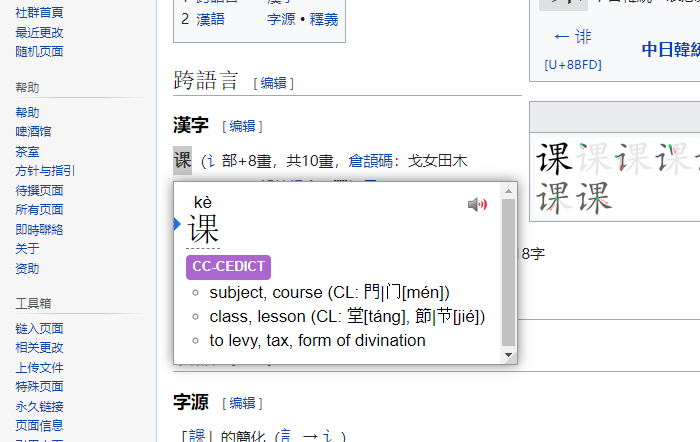
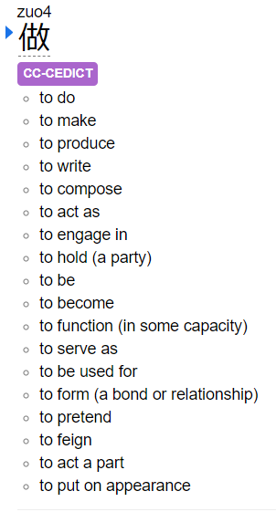

# CC-CEDICT dictionary for Yomichan

A Python script that converts the CC-CEDICT file to a Yomichan-supported dictionary file.

[Yomichan](https://foosoft.net/projects/yomichan/) is a browser extension, mainly used for Japanese, which allows opening dictionaries when mouse is over a word.

Although there already exists a [CC-CEDICT dictionary](https://gist.github.com/shoui520/25460fd2e9fb194d3e5152fa2ce42ca2) from shoui, it is not simplistic enough, for example the searched word and its pinyin can be seen twice. Thus, I created my own version for it.



The dictionary has new bullet points after classifiers (CL) because there usually is a new meaning after them. Other dictionaries usually lump everything into one line, which is not desirable.

It is also possible to use bullet points as the seperator instead of commas and express tones with numbers. Bullet points make sense with words which don't have classifiers. Tone numbers are useful because ā and ǎ look the same when the font is small.



### Download
https://github.com/anttipham/cc-cedict-for-yomichan/releases/latest

### Install

1. You need to have [Yomichan](https://foosoft.net/projects/yomichan/).
2. Download the dictionary (zip file) from the Download section and don't unzip it.
3. Yomichan > Settings > Dictionaries > Configure installed and enabled dictionaries... > Import.
4. Choose the dictionary (zip file).

### Build

CC-CEDICT can be downloaded from here. https://www.mdbg.net/chinese/dictionary?page=cc-cedict

Run by typing
```
main.py <unpacked cc-cedict filepath>
```
If you want bullet point seperators, use `--seperate` flag. Pinyin numbers can be enabled with `--pinyin-numbers` flag.